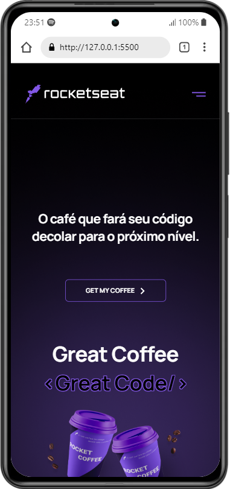

<h1 align="center">Responsive Coffee Homepage</h1>
This is a solution for a challenge of Discover Rocketseat's course. It's about a coffee brand homepage with a burger menu in mobile version.

## Desktop Overview 🖳

## Mobile Overview 📱

## Link 🔗
- [Coffee Homepage](https://antonio-savio.github.io/responsive-coffee-homepage/)

## Functionalities ☑️
This application must be able to:
- Adapt layout through different screen sizes.
- Handle a burger menu in mobile version.
- Show an animation when the burger is clicked.

## Used Tools ⚙️
- CSS
- HTML
- JavaScript
